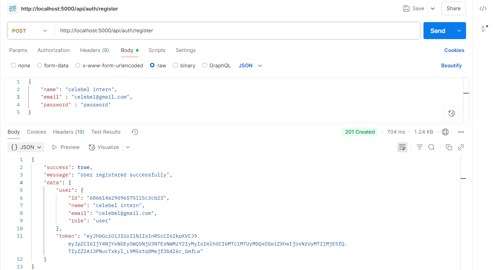
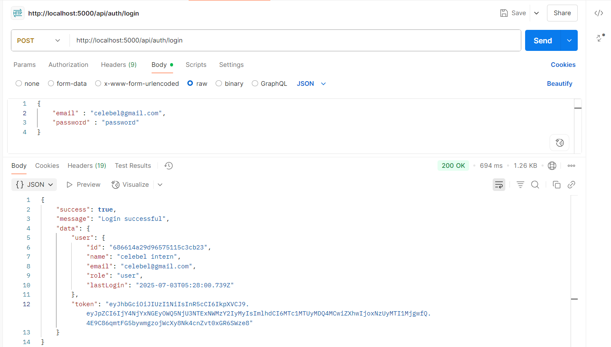
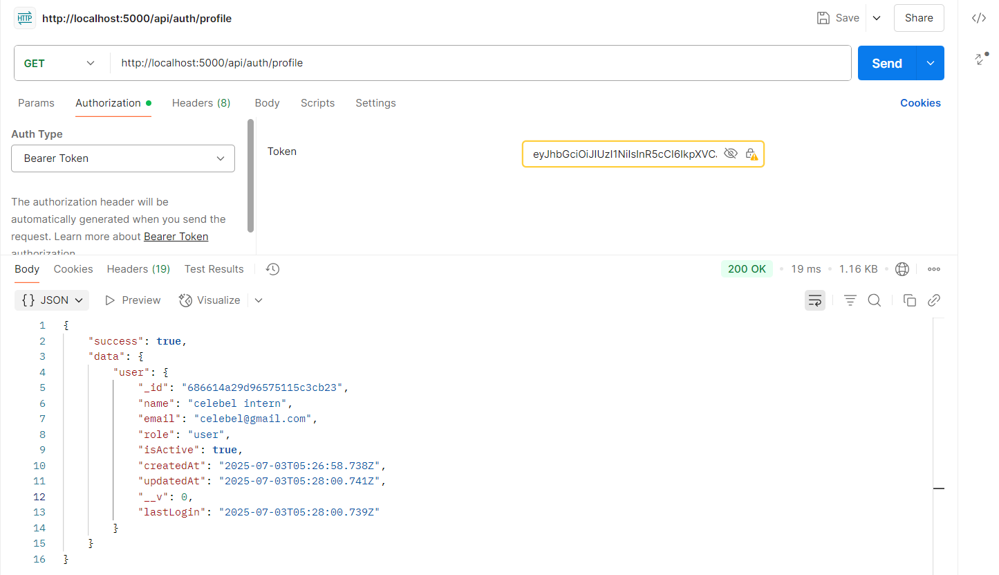
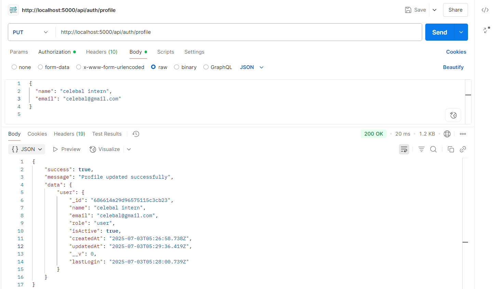
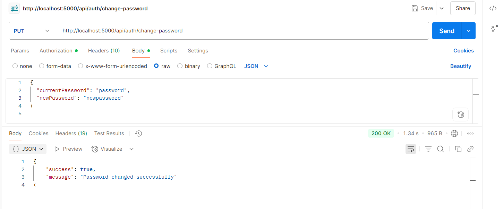

# 🔐 Node.js REST API with JWT Authentication

This project implements a secure, token-based authentication system using **JWT (JSON Web Tokens)** in a Node.js + Express + MongoDB REST API. Users can register, log in, update profiles, change passwords, and access protected routes.

---

## 📁 Project Structure
```
project-root/
│
├── controllers/
│   └── authController.js
├── models/
│   └── User.js
├── routes/
│   └── authRoutes.js
├── middleware/
│   └── auth.js
├── utils/
│   └── generateToken.js
├── .env
├── server.js
└── README.md
```


---

## 🚀 Features

- 🔒 User registration and login  
- 🔑 JWT-based authentication (secure and stateless)  
- 🔐 Protected routes using middleware  
- 👤 Profile and password management  
- 🧪 Postman-ready API endpoints  

---

## 🔐 JWT-Based Authentication

We use JWT for user authentication and session management. Here’s how it works:

1. **User logs in or registers** — receives a **JWT** token.  
2. Token is stored on the client (frontend / Postman) and sent via headers.  
3. Protected routes validate the token using middleware.

---

## 📮 API Endpoints with Postman Screenshots

> 💡 Make sure the screenshots (`register.png`, `login.png`, etc.) are in the same directory as `README.md`, or use an `images/` folder and update the paths.

### 📌 1. Register User

**POST:** `http://localhost:5000/api/auth/register`



---

### 📌 2. Login User

**POST:** `http://localhost:5000/api/auth/login`



---

### 📌 3. Get User Profile

**GET:** `http://localhost:5000/api/auth/profile`



---

### 📌 4. Update User Profile

**PUT:** `http://localhost:5000/api/auth/profile`



---

### 📌 5. Change Password

**PUT:** `http://localhost:5000/api/auth/change-password`



---

## 🔧 Environment Variables

Create a `.env` file in the root directory and add:
```
PORT=5000
MONGO_URI=mongodb://localhost:27017/authdb
JWT_SECRET=jwt-token-secret
JWT_EXPIRE=7d
NODE_ENV=development
```

---

## ✅ Getting Started

### 1. Clone the repository

```bash
git clone https://github.com/your-username/your-repo.git
cd your-repo


2. Install dependencies
npm install

3. Run the server
npm start

👨‍💻 Author
Harsheel Kasodariya – [harsheel55] (https://github.com/harsheel55)

📄 License
This project is licensed under the MIT License.

---

Let me know if you want it:
- Downloaded as a `.md` file  
- Automatically adjust for image folder like `images/register.png`  
- With a clickable link to your GitHub profile and repo
